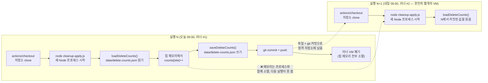

# Node 스크립트/배치 잡 설계 패턴

## 2026-08-31 — knu-notice-collector 코드 설명 중 정리

### Strategy + Registry 패턴 (문자열 키 → 함수 매핑)
사이트별로 다른 파싱 로직(전략)이 필요할 때, if/else나 switch로 분기를 하드코딩하는 대신
**"이름 → 함수" 매핑 객체(레지스트리)** 하나만 두고 그 이름을 데이터(설정)로 넘겨받는 방식.

```js
// src/parsers/index.js:19-37
export const parsers = {
  gnuboard: parseGnuboard,
  knuHome: parseKnuHome,
  knuWbbs: parseKnuWbbs,
  // ... (사이트 종류만큼 계속)
  dacon: parseDacon,
};
```

```js
// src/collect.js:41-46
const parse = parsers[site.parser];
if (!parse) {
  console.error(`[${site.name}] 알 수 없는 파서 종류: ${site.parser}`);
  continue;
}
```

`site.parser`라는 문자열 하나로 실제 실행할 전략(파서 함수)을 런타임에 조회함. "새 사이트 =
새 파서 함수 작성 + `parsers` 객체에 한 줄 등록"으로 확장 지점이 한 곳에 모임. 이 패턴이
성립하려면 **모든 전략이 동일한 함수 시그니처를 지켜야 함** — 여기서는 파서 전부가
`(html, baseUrl) => [{id, title, url}, ...]` 계약을 따르기 때문에 레지스트리 하나로 통합 가능.

### 수집(fetch) 계층과 해석(parse) 계층의 분리
"데이터를 어떻게 가져왔는지"와 "가져온 데이터를 어떻게 해석하는지"를 완전히 분리해두면,
수집 방식이 늘어나도 해석 계층은 손댈 필요가 없음.

```js
// src/browser.js:20-23
// mode: "dynamic" 사이트의 콘텐츠를 렌더링해서 완성된 HTML을 반환한다. 반환값은
// 정적 fetch와 동일하게 순수 HTML 문자열이므로, 이후 파서(src/parsers/*)는
// static/dynamic 여부를 몰라도 된다.
export async function fetchDynamicHtml(site) {
```

`fetchers.js`의 `fetchStaticText`(정적 fetch)와 `browser.js`의 `fetchDynamicHtml`(Playwright
렌더링)은 반환 타입이 똑같이 "순수 HTML 문자열"임. 그래서 SPA라서 브라우저 렌더링이 필요한
이벤터스·데이콘도, 결과물을 받는 `parsers/eventus.js` · `parsers/dacon.js` 코드는 cheerio 기반
정적 파서와 완전히 같은 패턴으로 작성돼 있음 — 파서 입장에서는 인풋이 어디서 왔는지 알
필요가 없는, 관심사 분리(Separation of Concerns)의 구체적인 예.

### 배치 잡에서 항목 단위 에러 격리 (try/catch를 루프 몸통 안에 두기)
여러 개의 독립적인 외부 자원(사이트)을 순회하며 처리할 때, try/catch를 **어디에 두느냐**가
"실패 하나가 전체를 멈추는지, 그 항목만 건너뛰는지"를 가름.

```js
// src/collect.js:40-96 (구조만 발췌)
for (const site of sites) {
  const parse = parsers[site.parser];
  if (!parse) { /* ... */ continue; }

  try {
    const html = await fetchSiteContent(site);
    const items = parse(html, site.url);
    // ... 새 글 판별 + 노션 적재 ...
  } catch (err) {
    console.error(`[${site.name}] 수집 실패: ${err.message}`);
  }
}
```

try/catch가 `for` 루프 **안쪽**에 있어서, 사이트 하나가 네트워크 오류나 파싱 예외로 실패해도
`catch`가 그 자리에서 로그만 남기고 다음 반복(다음 사이트)으로 넘어감. 만약 이 try/catch를
루프 **바깥**에 뒀다면 사이트 하나의 실패로 나머지 20개 사이트 수집이 전부 중단됐을 것.
여러 독립 작업을 순회하는 배치/ETL 스크립트 전반에 적용 가능한 내결함성(fault isolation)
패턴 — 실패를 전체 실행 단위가 아니라 가장 작은 작업 단위로 국한시킴.

### 안정적인 id가 없을 때 컨텐츠 해시로 아이덴티티 만들기
게시판에 안정적인 숫자 id가 없을 때, 그 대신 **내용(문자열)을 해시한 값**을 id로 씀.

```js
// src/parsers/common.js:3-5
export function shortHash(input) {
  return crypto.createHash("md5").update(input).digest("hex").slice(0, 12);
}
```

```js
// src/parsers/knuHome.js:12-20
$("a[href*='mode=view']").each((_, el) => {
  const href = $(el).attr("href");
  if (!href) return;
  const title = cleanText($(el).text());
  if (!title) return;
  const id = shortHash(href);        // href 문자열 자체를 md5 해시해 id로 사용
  if (seenIds.has(id)) return;
  seenIds.add(id);
  items.push({ id, title, url: new URL(href, baseUrl).toString() });
});
```

"새 글인지 판단"이라는 목적에는 완벽한 유일성보다 **같은 입력이면 항상 같은 출력**이라는
안정성만 있으면 충분하다는 관점. **더 공부해볼 것**: 12자(48비트) md5 절단본의 충돌 확률이
이 프로젝트 규모(사이트당 글 수백~수천 건)에서 실질적으로 무시 가능한 수준인지 감(생일
문제/birthday paradox)을 잡아두면, 비슷한 "안정 id 없는 데이터에 식별자 붙이기" 문제를
만났을 때 판단 기준이 됨.

## 2026-09-05 — 임베딩 관련성 필터를 collect.js에 어디에 넣을지 판단하며 정리

### 비용이 큰 필터는 "이미 걸러진 뒤"의 좁은 집합에만 적용
사이트에서 파싱해온 `items`(오늘 페이지에 걸린 글 전체)와, 그중 아직 처리 안 한
`newItems`(`seenIds`로 dedup된 진짜 새 글)는 크기가 완전히 다르다. 임베딩 계산처럼 비용이
드는 작업(모델 추론)을 어느 쪽에 걸 것인지가 실행 비용을 좌우함.

```js
// src/collect.js:63-65, 78-83 (구조만 발췌)
const seenIds = new Set(store[site.id] ?? []);
const newItems = items.filter((item) => !seenIds.has(item.id)); // 여기서 이미 대상이 좁혀짐

// ... siteIsFirstRun이면 여기서 continue로 아예 안 들어옴 ...

for (const item of newItems) {           // items 전체가 아니라 newItems만 순회
  const { relevant, score } = await isRelevant(item.title); // 진짜 새 글에만 임베딩 계산
  // ...
}
```

`items`(dedup 전) 단계에서 필터를 걸었다면: ① 어제도 있었던, 오늘은 어차피 스킵될 글까지
매일 다시 임베딩을 계산하고 ② 사이트 최초 실행(`siteIsFirstRun`)일 때도 baseline 저장 외엔
안 쓰일 결과를 위해 전체 글을 계산하게 됨. 비용이 있는 필터/변환은 **파이프라인에서 이미
최대한 좁혀진 지점**(여기서는 dedup 직후, first-run 분기 이후)에 놓아야 낭비가 없다는,
배치/ETL 스크립트 전반에 적용되는 원칙.

## 2026-09-10 — 사이트별 삭제 누적 카운트(`data/delete-counts.json`)를 어디에 저장할지 논의 중 정리

### GitHub Actions는 실행마다 프로세스가 통째로 새로 뜬다 — 힙 메모리는 절대 이어지지 않는다
`.github/workflows/collect.yml`의 `on.schedule`(cron)이 트리거되면 GitHub은 매번 **새 임시
VM(러너)**을 띄우고, `actions/checkout`으로 저장소를 처음부터 다시 clone한 뒤 `node
src/collect.js` 같은 명령으로 **완전히 새로운 Node 프로세스**를 시작한다. 이 프로세스가
`import`로 모듈을 평가하는 순간 만들어지는 모든 것 — 배열 리터럴(`sites.js`의 `sites`),
전역 변수, 클로저에 잡힌 값 — 은 전부 이 프로세스의 힙 메모리에만 존재한다. 러너가 작업을
마치고 폐기되면(다음 스케줄 실행까지 살아있지 않음) 그 힙은 통째로 사라진다. 다음날 실행은
이 메모리를 전혀 모르고, `sites.js`를 처음부터 다시 읽어서 "카운트 0"인 상태로 시작한다.

CI yml 자체의 트리거/권한/커밋 문법은 [GitHub Actions / CI yml 작성법](github-actions-ci.md)에
이미 정리돼 있음(3-11줄, 319-360줄) — 여기서는 그 위에서 **애플리케이션 코드가 이 전제를
깨뜨리는 방식으로 상태를 설계하면 왜 조용히 망가지는지**에 집중한다.



파일로 쓰고 `git push`까지 해야 화살표가 러너 #1 → #2로 이어진다. 메모리에만 있던 값(`A4`)은
애초에 러너 경계를 넘는 경로가 없다 — "다음 실행에서 이어받겠지"라는 가정 자체가 이 아키텍처와
안 맞는다.

### `store.js`가 이미 만들어둔 계약: "상태는 반드시 파일 I/O 함수를 통해서만 드나든다"

```js
// src/store.js:8-21
export async function loadStore() {
  try {
    const raw = await fs.readFile(STORE_PATH, "utf-8");
    return { data: JSON.parse(raw), isFirstRun: false };
  } catch (err) {
    if (err.code === "ENOENT") return { data: {}, isFirstRun: true };
    throw err;
  }
}

export async function saveStore(data) {
  await fs.mkdir(path.dirname(STORE_PATH), { recursive: true });
  await fs.writeFile(STORE_PATH, JSON.stringify(data, null, 2), "utf-8");
}
```

핵심은 **상태를 직접 만지는 코드가 `loadStore`/`saveStore` 두 함수 뒤로 완전히 숨어 있다**는
점이다. 호출부(`collect.js`)는 "파일이 어디 있는지", "처음 실행인지 아닌지 어떻게 아는지"를
전혀 몰라도 되고, `ENOENT`(파일이 아직 없음 = 진짜 첫 실행) 처리도 이 안에 한 번만 있다.
`data/delete-counts.json`도 같은 모양(`loadDeleteCounts`/`saveDeleteCounts`)으로 만들면,
"프로세스 경계를 넘는 상태는 전부 이 두 함수 짝을 통해서만 오간다"는 규칙이 파일 하나 늘어도
그대로 유지된다. `JSON.stringify(data, null, 2)`로 들여쓰기를 남기는 것도 의도적 — 이 파일이
git에 커밋되므로, 사람이 diff로 "오늘 어떤 사이트 카운트가 늘었는지" 눈으로 봐도 알아볼 수
있게 하기 위함(실제로 `data/seen.json`도 같은 이유로 pretty-print됨).

### 지금 코드에서 이미 해결된 부분 vs 아직 진행 중인 부분

**이미 해결됨 — `collect.js`의 dedup 상태**는 정확히 이 패턴을 따른다:
```js
// src/collect.js:38, 64-65, 100, 103, 128
const { data: store, isFirstRun } = await loadStore();      // 실행 시작: 파일에서 상태 로드
// ...
const seenIds = new Set(store[site.id] ?? []);               // 힙에 올려서 이번 실행에서만 빠르게 조회
const newItems = items.filter((item) => !seenIds.has(item.id));
// ...
seenIds.add(item.id);                                         // 새 글 발견 시 힙에서 갱신
// ...
store[site.id] = Array.from(seenIds);                         // 힙 → store 객체로 다시 반영
// ...
await saveStore(store);                                       // 실행 끝: 파일에 저장(이후 워크플로우가 커밋)
```
`Set`은 이번 실행 **안에서만** 조회 속도를 위해 쓰는 임시 자료구조이고, 진짜 영속되는 값은
`store` 객체(→ `saveStore`가 쓰는 파일)라는 걸 분명히 구분하고 있다.

**진행 중(이번 대화 시점 기준 미완성)**: `notion.js:71-78`가 Notion에서 `사이트` 속성까지
읽어와 candidate 객체에 `site` 필드를 추가하도록 확장됐고, `cleanup-apply.js:32-37`에는
`collectDeletedSites(item)`라는 자리만 만들어져 있는 상태(내부 로직 비어있음, 디버깅용
`return`(58, 59줄)이 남아 있어 실제로 이 함수까지 도달하지 않음). 아직 `data/delete-counts.json`을
읽고/쓰는 코드는 연결되지 않았다 — 이 빈 파일(`{}`)만 미리 만들어둔 상태.

**폐기 대상(죽은 코드)**: `cleanup-detect.js:85-93`의 `getDeleteUrl` 함수는 `sites[element.url]`
로 접근을 시도하는데, `sites`(`sites.js`)는 배열이라 문자열 인덱싱이 안 되고, `element.url`은
애초에 개별 글의 URL이라 사이트 URL과 매칭될 수도 없다. 이 함수는 어디서도 호출되지 않는
미완성 실험 코드로 남아 있다.

### 앞으로 비슷한 실수를 반복하기 쉬운 대표 케이스 3가지

**1) import한 설정 배열/객체를 직접 mutate해서 카운터로 쓰기**
```js
// 이런 식으로 하고 싶어지기 쉬움(실제 시도된 방향)
import { sites } from "./sites.js";
sites.find(s => s.id === item.site).count++;   // ❌
```
`sites.js`는 순수 ES 모듈 리터럴이라, import할 때마다 그 프로세스 안에서 새로 평가된다.
mutate해봤자 다음 실행에서는 원본 그대로 돌아온다 — "설정 파일이니까 어딘가 남아있겠지"라는
직관이 틀리는 지점. **해답**: 카운터는 `sites.js` 밖, `data/delete-counts.json` 같은 파일에
`{ [siteName]: count }` 형태로 독립적으로 둔다.

**2) 모듈 최상단 전역 변수에 "누적"시키려 하기**
```js
let totalDeleted = 0;                 // 모듈 스코프
function onDelete() { totalDeleted++; }
```
이 자체가 잘못은 아니다 — **한 번의 실행 안에서** 여러 사이트를 순회하며 합계를 내는 용도라면
(`collect.js:39`의 `totalNew`가 정확히 이 용법) 전역 변수로 충분하다. 문제는 이 값을 "어제 +
오늘 + 내일..."처럼 **실행을 가로질러(cross-run)** 누적하려는 순간이다. 전역 변수든 `sites.js`
mutate든 본질은 같음(둘 다 힙 메모리) — **한 프로세스 생애 안에서의 집계**와 **여러 프로세스에
걸친 누적**을 구분하는 게 핵심이고, 후자는 항상 파일(혹은 외부 저장소) 경계를 거쳐야 한다.

**3) "본 적 있는 항목"을 in-memory Set/Map만으로 추적하려 하기 (이미 해결된 대조 사례)**
새 글 dedup을 `const seenIds = new Set()`처럼 매 실행 빈 Set에서 시작하면, 어제 이미 본 글을
오늘 또 "새 글"로 오인해서 Notion에 중복 적재하게 된다. `collect.js:64`가 이 문제를 피한
방법이 바로 위 "이미 해결된 부분"에서 인용한 코드 — **빈 Set이 아니라 `store[site.id] ?? []`로
시작**한다. 즉 Set/Map 자체가 문제가 아니라, 그걸 "빈 상태로 시작하느냐, 파일에서 로드한 값으로
시작하느냐"가 갈림길이다.

### 설계 원칙: 설정(config)과 런타임 상태(state)를 같은 파일에 섞지 않는다

이 프로젝트는 이미 이 원칙을 두 파일 종류로 나눠서 지키고 있다:

| | `sites.js` | `data/*.json` |
|---|---|---|
| 무엇을 담나 | 어떤 사이트를 어떤 파서로 수집할지 | 어제까지 뭘 봤는지/삭제했는지(누적값) |
| 누가 언제 바꾸나 | 사람이 새 사이트 추가할 때 직접 편집 | 스크립트가 실행마다 자동 갱신 |
| git 이력의 의미 | "수집 대상이 바뀌었다"는 의도적 결정 | "오늘 실행 결과"라는 기계적 부산물 |
| 리뷰 방식 | PR로 diff를 사람이 읽고 판단 | `[skip ci]` 커밋으로 조용히 쌓임(`github-actions-ci.md`의 "조건부 커밋" 패턴) |

만약 카운터를 `sites.js` 안에 (예: `numberOfDelete` 필드로) 얹었다면, 이 표의 왼쪽·오른쪽 성격이
한 파일 안에서 뒤섞인다: 매일 자동으로 바뀌는 숫자 때문에 `sites.js`의 git diff가 실제 설정
변경(새 사이트 추가, 파서 교체)과 구분이 안 되고, "이 diff는 내가 고친 건가 봇이 고친 건가"를
매번 파일을 열어 확인해야 한다. 반대로 상태 파일이 `sites.js`와 분리돼 있으면, `sites.js`의
git blame은 언제나 "사람이 의도적으로 바꾼 이력"만 남는다.

이건 이 프로젝트만의 관습이 아니라 더 일반적인 원칙의 구체적 적용이다: [12-Factor
App](https://12factor.net/)의 "config는 코드와 분리해 환경에 둔다"는 항목이나, Kubernetes에서
`ConfigMap`(설정)과 `PersistentVolume`/외부 DB(상태)를 다른 리소스로 관리하는 것도 같은
이유("정적으로 선언되고 사람이 리뷰하는 것" vs "런타임에 계속 바뀌는 것"은 수명 주기와 변경
주체가 다르므로 같은 저장소·같은 리뷰 절차에 두면 안 된다)에서 나온다.

## 2026-09-11 — 위 설계를 실제로 구현하며 마주친 스코프/자료구조 실수 정리

`data/delete-counts.json`을 실제로 연결하는 코드(`collectDeletedSites`, id→item 복원)를
직접 짜보면서 만난, async/await 범주 밖의 실수들. (await 관련 실수는
[JS/Node 비동기 패턴](js-async-patterns.md)의 2026-09-11 절 참고.)

### 블록 스코프 변수가 분기 경계를 못 넘는 사고, 형태를 바꿔가며 두 번 반복

**1번째 — `for` 안에서 만든 값을 `for` 밖에서 쓰려던 시도**
```js
// 당시 실제 코드(지금은 고쳐짐) — src/cleanup-apply.js
for (const c of current) {
  let data = collectDeletedSites(c);
}
saveStoreDeleted(data);   // ReferenceError: data is not defined
```
**2번째 — 완전히 같은 모양이 다른 변수로 재발**
```js
// 당시 실제 코드(지금은 고쳐짐)
for (const id of toArchive) {
  const item = current.find((c) => c.id === id);
}
const modifiedData = collectDeletedSites(data, item);  // item은 여기서 안 보임
```
`let`/`const`는 그게 선언된 가장 가까운 `{}` 블록에서만 살아있다 — `for` 문의 몸통도 하나의
블록이라, 그 안에서 선언한 변수는 반복이 끝나는 순간 사라진다. 두 경우 다 "루프 안에서 값을
누적/추출해서 루프 밖에서 쓰겠다"는 의도였는데, 정작 그 값을 **루프 블록 안에서만** 선언해서
막힌 것. 게다가 2번째는 스코프를 고쳐도 또 문제였음 — 저 루프는 `id` 하나당 `item` 하나씩
찾아서 **마지막 것만 남기고 매번 덮어쓰는** 구조라, 설령 밖으로 꺼내도 "toArchive 전체"가
아니라 "마지막 1건"만 남았을 것.

**해법**: 값을 루프 밖에서도 쓰려면 애초에 루프 **밖**에서 배열/객체로 선언해두고 루프 안에서는
그걸 채우기만 하거나(예: `.push()`), 아니면 아예 `.map()`/`.filter()`처럼 배열 전체를 한 번에
변환하는 표현식으로 바꿔서 "루프 몸통 안의 임시 변수"라는 개념 자체를 없애는 것. 실제로 최종
코드는 후자를 택함:
```js
// src/cleanup-apply.js:101-102
const currentById = new Map(current.map(c => [c.id, c]));
const archivedItems = toArchive.map((id) => currentById.get(id));
```

### `Map`을 함수처럼 호출한 오타 — `.get()`을 빼먹음
```js
// 당시 실제 코드(지금은 고쳐짐)
const archivedItems = toArchive.map((id) => currentById(c));
```
두 가지가 겹쳐 있었음: ① `currentById`는 `new Map(...)`으로 만든 **룩업 테이블 객체**라
`currentById(...)`처럼 함수 호출 문법으로 쓸 수 없다(`TypeError: currentById is not a
function`) — 값을 꺼내려면 반드시 `.get(key)` 메서드를 거쳐야 함. 배열의 `.find(callback)`에
익숙하면 "조회 = 그냥 괄호로 호출"이라는 감각이 남아있어서 헷갈리기 쉬운 지점. ② 콜백
파라미터도 `id`인데 바로 위 줄(`current.map(c => [c.id, c])`)의 `c`가 눈에 익어서 그대로
옮겨 적힌 채였음 — 두 실수가 겹쳐서 한 줄에서 동시에 드러남.

### count 초기화 off-by-one — "처음 봤다"는 것 자체가 이미 1번째라는 걸 놓침
```js
// src/cleanup-apply.js:41-45 (지금은 고쳐진 최종 모습)
if (!(site in data)) {
  data[site] = { count: 1 };   // 최초엔 0이 아니라 1이어야 함 — 이 호출 자체가 첫 삭제니까
} else {
  data[site].count++;
}
```
처음엔 `{count: 0}`으로만 초기화하고 `else` 분기에서만 `++`를 했었음 — 그러면 "처음 보는
사이트를 만난 이 순간"이 사실 그 사이트의 **첫 번째** 삭제인데도 카운트에 반영이 안 되고,
두 번째 삭제부터 증가가 시작됨. "존재 여부로 분기하는 초기화 로직"에서 흔히 나는 off-by-one 
— 분기 자체가 "이미 한 번 일어난 일"을 처리하고 있다는 걸 놓치기 쉬움.

### 빈 파일(0바이트)과 "파일이 아예 없음"을 구분 못한 `JSON.parse` 실수
> 질문: "raw가 빈 파일이면 json.parse가 안되던데, 그럼 맨처음에 seen 작업할땐 에러가 나야했던
> 거 아냐?"

`loadStore`/`loadStoreDeleted`의 `catch (err) { if (err.code === "ENOENT") ... }`는 딱
"**파일 자체가 없음**" 한 가지만 잡는다. `JSON.parse("")`는 `SyntaxError`를 던지는데 이건
`.code`가 `"ENOENT"`가 아니라서 그 `if`를 그냥 통과해 밖으로 던져진다. `seen.json`이 지금까지
안 터진 건 설계가 달라서가 아니라, `saveStore`가 항상 유효한 JSON만 써왔기 때문에 "파일은
있는데 내용이 빈" 상태를 실제로 만난 적이 없었을 뿐 — 두 로더 함수 모두 같은 구멍을 갖고
있었음.
```js
// src/store.js:14-16 (최종 수정)
const raw = await fs.readFile(STORE_PATH, "utf-8");
const trimmed = raw.trim();
return { data: trimmed ? JSON.parse(trimmed) : {}, isFirstRun: false };
```
`catch`에서 `SyntaxError`까지 넓게 잡아 `ENOENT`와 똑같이 처리하는 대안도 있었지만 택하지
않음 — 그러면 "정말 아무 내용도 없음"과 "쓰다가 중간에 프로세스가 죽어서 진짜로 깨진 JSON"을
구분 못 하고 후자도 조용히 `{}`로 리셋해버려, 그동안 쌓인 카운트가 에러 한 번 없이 사라지는
대참사가 날 수 있음. 빈 문자열만 파싱 **전에** 먼저 걸러내면, "내용 없음(첫 실행과 동등)"과
"내용 있는데 깨짐(시끄럽게 실패해야 하는 진짜 문제)"을 구분할 수 있음. 빈 값의 기본형도
`[]`가 아니라 `{}`로 맞춤 — `data[site] = {...}`, `site in data`처럼 나머지 코드 전체가
`data`를 객체로 가정하고 쓰기 때문.

### 설계 질문: 함수가 데이터를 반환만 하고, 저장(파일 쓰기)은 호출부에서 하는 게 맞나?
> 질문: "결국 data store은 전체에 대해서 한번에 해야해서 함수에서 data return 받고 이걸
> save에 넣을 생각이야. 이렇게 하는 게 설계 관점에서 괜찮을까?"

맞는 방향이었음 — 근거 두 가지:
1. `collect.js`가 이미 이 모양(`loadStore()` 한 번 → 루프 전체에서 `store` mutate → 루프 끝나고
   `saveStore(store)` 한 번, `src/collect.js:38, 103, 128`)이라 새 함수도 같은 관례를 따르는 게
   일관적.
2. **계산(순수 함수)과 저장(I/O)을 분리**하면, `DRY_RUN`일 때 저장만 쏙 빼고 건너뛰는 걸(지금
  `cleanup-apply.js`의 두 분기 모두 DRY_RUN에서는 `saveStoreDeleted`를 아예 안 부름) 호출부
  한 곳에서 결정할 수 있음. 저장 로직이 함수 안에 있었으면 DRY_RUN 여부를 함수 내부까지
  파라미터로 넘겨야 했을 것 — 단일 책임 원칙(하나의 함수는 하나의 이유로만 바뀌어야 한다)을
  "계산"과 "영속화"라는 두 축으로 쪼갠 구체적 사례.
