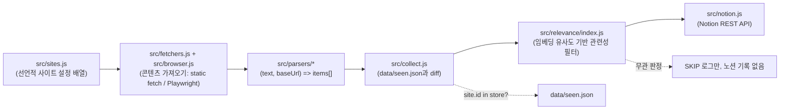

# 아키텍처

## 데이터 흐름

## 컴포넌트 책임

- **`src/sites.js`** — 순수 데이터. 사이트마다 `{id, name, url, parser, category, target, mode?, encoding?, requestBody?, userAgent?, waitForSelector?, timeoutMs?, insecureTLS?}`. `mode`가 없으면 `"static"`으로 취급 — 기존 9개 항목은 무변경. `insecureTLS: true`는 서버가 TLS 중간 인증서 체인을 완전히 보내지 않는 사이트에만 쓴다(실측으로 필요할 때만 추가, docs/adr/0003 참고).
- **`src/fetchers.js`** — `mode: "static"` 사이트를 처리. Node 내장 `fetch` + `AbortController` 타임아웃. `encoding: "euc-kr"`이면 `iconv-lite`로 디코딩, `requestBody`가 있으면 POST+JSON(ccei 같은 JSON API 대상).
- **`src/browser.js`** — `mode: "dynamic"` 사이트를 처리. Playwright Chromium 인스턴스를 지연 초기화 싱글톤으로 재사용(`getBrowser()`), 사이트마다 새 `BrowserContext`를 열고 `finally`에서 `close()`. `waitForSelector`가 지정되면 그 셀렉터를, 없으면 고정 그레이스 타임을 기다린 뒤 `page.content()`로 완성된 HTML을 반환.
- **핵심 설계 결정**: 정적/동적 어느 경로든 **최종적으로 완성된 HTML 문자열을 반환**하므로, `src/parsers/*`의 파서 함수는 `mode`를 몰라도 된다. 파서는 항상 동일한 시그니처 `(text: string, baseUrl: string) => { id, title, url }[]`를 가지며, cheerio 기반 DOM 셀렉터(또는 ccei처럼 `JSON.parse`)로 목록을 추출한다. "동적 전용 파서"라는 별도 카테고리는 없다.
- **`src/collect.js`** — 사이트 배열을 순차 순회하며 `fetchSiteContent(site)` → `parsers[site.parser](text, site.url)` → `data/seen.json`과 diff → 새 항목만 `addFeedItem`으로 노션에 씀. 사이트별 실패는 try/catch로 격리해 한 사이트 오류가 전체를 막지 않는다. 최초실행 판단은 **사이트 단위**(`site.id in store`)로 하여, 신규 사이트 추가 시 그 사이트의 현재 게시글 전체가 스팸으로 올라가는 것을 막는다.
- **`src/relevance/`** — 새 글 제목이 CS/개발 관련인지 판단하는 필터. `embed.js`가 `@xenova/transformers`로 문장을 384차원 벡터로 변환(모듈 singleton으로 lazy-load, 캐시 경로는 `.cache/transformers`로 고정 — `docs/adr/0008`)하고, `prototypes.js`의 양성/음성 기준 문장들과 `similarity.js`의 코사인 유사도로 `margin = maxPosSim - maxNegSim`을 계산(`index.js`의 `scoreTitle`)한 뒤 `RELEVANCE_THRESHOLD`(`.env`)와 비교해 관련 여부를 정한다(`isRelevant`). 판단 중 예외가 나거나 `RELEVANCE_FILTER_DISABLED=1`이면 fail-open으로 관련 글 취급한다. `src/collect.js`의 `newItems` 루프 안, 노션 기록 직전에서 호출된다.
- **`src/notion.js`** — Notion REST API(`/v1/pages`)로 새 글 피드 DB에 페이지 생성.
- **`data/seen.json`** — 사이트별로 이미 노션에 올린 글 id 배열을 저장하는 상태 파일. GitHub Actions가 실행 후 이 파일의 변경분을 커밋해 다음 실행이 이어받는다.

## 새 사이트 추가 절차

1. 대상 URL을 curl(또는 브라우저 개발자도구)로 확인해 정적 HTML에 목록이 있는지, 아니면 클라이언트 렌더링(SPA)인지 판단한다.
2. **정적**이면: 기존 3개 템플릿(`gnuboard`/`knuHome`/`knuWbbs`)과 구조가 같으면 `sites.js`에 항목만 추가. 다르면 `src/parsers/`에 새 파서 함수를 추가하고 `src/parsers/index.js`의 `parsers` 객체에 등록.
3. **동적(SPA)**이면: `sites.js` 항목에 `mode: "dynamic"`과 목록이 렌더링된 뒤 나타나는 `waitForSelector`를 지정하고, 파서는 정적 파서와 동일하게 cheerio로 작성(입력이 `page.content()`로 얻은 HTML이라는 점만 다름).
4. 봇 차단(403)이 의심되면 `site.userAgent`로 개별 UA를 지정하거나, 응답이 EUC-KR이면 `site.encoding: "euc-kr"`을 지정.
5. `DRY_RUN=1 npm run collect`로 실제 노션 쓰기 없이 파싱 결과를 로그로 검증한 뒤, 정상 실행으로 전환한다.
